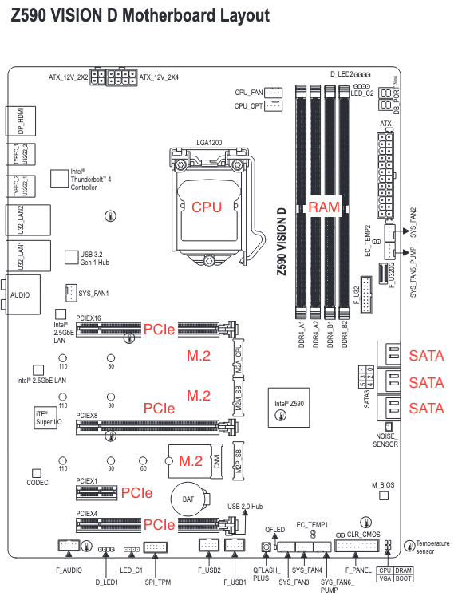

# Efficient hardware

**Learning objectives:**

- What is a byte?
- Learn how the CPU, RAM (memory), and HDD/SSD (storage) contribute to overall speed
- 32-bit vs 64-bit and some ways to work with 32-bit from 64-bit
- What you can do so you don't have to worry about any of this

## What is a byte? {-}

- Computers only store and work with bits
  - Binary, 1 or 0, on or off
- The 128 ASCII characters could be represented with 7 bits
  - $2^7=128$
  - An 8th bit was later added as computers moved more towards powers of 2
- 8 bits make a byte (a whole ASCII character)
  - In a pure conversion, 100 characters == 100 bytes
  - This is often not straightforward since the file itself or anything else can take up more space
  
## Understanding Computer Sizes {-}

- Sizes are calculated as either powers of two or powers of ten
  - Powers of two are known as *bibytes such as kibi-, mebi-, or gibi
  - Powers of ten are known as *bytes such as kilo-, mega, or giga
    - The important part is that the first two letters are the same
  - This accounts for the difference between advertised size and actual size
    - A hard drive may be advertised as 1TB, but only has 931GB of usable storage
    
```{r echo=FALSE, message=FALSE}
library(ggplot2)
library(dplyr)
library(tidyr)
prefixes <- c("ki", "me", "gi", "te", "pe", "ex", "ze", "yo")
data.frame(
  prefix = factor(prefixes, levels = rev(prefixes)),
  index = 1:8,
  regular_bytes = 2^(seq(10, 80, by = 10)),
  ibibytes = 10^(seq(3, 24, by = 3))
) |>
  mutate(difference = regular_bytes - ibibytes) |>
  pivot_longer(cols = regular_bytes:difference) |>
  ggplot() +
  geom_line(aes(x = index, y = log2(value), color = name, linetype = name), linewidth = 2) +
  theme_minimal() +
  scale_x_continuous(breaks = 1:8, labels = prefixes) +
  scale_color_discrete(name = "", type = hcl.colors(3, palette = "Dynamic")) +
  scale_linetype_discrete(name = "") +
  labs(
    x = "Prefix",
    y = "2^n",
    title = "Comparison of 'ibibytes' and 'regular bytes'"
  ) +
  theme(
    legend.position = "bottom"
  )
```

## The Motherboard {-}



## The CPU {-}

- The Central Processing Unit (like a computer's brain)
  - The CPU is placed directly on the motherboard (like the body of a computer)
- Clock speed is measured in Hz (cycles per second)
  - Nowadays computers are measured in GHz (gigahertz)

## CPUs as a Coffee Shop {-}

- CPUs can have many cores
  - Each core can one or two threads

Imagine a coffee shop:

- Each espresso machine is one core
- Each thread is a barista working together on that machine

Adding more espresso machines adds a lot of throughput as drinks can now be made faster. Adding another person to each machine maybe be able to decrease downtime, but the two baristas may get in each others' way.

- The optimal number of cores or threads for a given operation can depend on the operation itself

## The CPU Deep Dive {-}

- Some computers have two or four CPUs
  - All CPUs must be identical
  - Practically, this just adds more cores/threads

- Most consumer CPUs have 6-24 cores, with some up to 64
- Server CPUs tend to have more cores than consumer and range up to 96 cores
  - They usually require special RAM
  - An enterprising consumer can buy a server CPU if they want to

- Historically AMD have had offerings with more cores than Intel, but Intel scores better on single-threaded benchmarks than AMD
  - Apple M series processors are blowing past these in some specific workflows
  
## RAM {-}

- RAM (random access memory) is memory that can be accessed randomly
  - You only have to read the bytes you need
  
- R loads data into RAM
  - This can limit how much data you can work with
  - Running close to the limit can slow things down
  - Old rule of thumb that RAM should be 3x your data
  
- RAM can often be upgraded, but increasingly it is soldered directly to the motherboard
  - Modern Apple computers use soldered RAM
  
## The RAM Deep Dive {-}

- There are varying generations of RAM from DDR2 to DDR5
  - This must be matched to the CPU and motherboard
  - Some CPUs and motherboards support a pair of sequential generations (DDR4/DDR5)
  - DDR5 is still relatively new and DDR4 is still very common
- RAM comes in different speeds inside each generation
  - The faster the RAM, the faster you can work with your data
  - RAM speeds must be matched to the CPU and motherboard
  
- CPUs support and motherboards have a certain number of "channels" for RAM
  - Usually a power of two
  - RAM prefers to be installed in pairs split across channels
    - Think of one very long hallway one-sided hallway vs a shorter hallway with doors on both sides
  - The RAM in each channel should match, but different channels can be different
    - This may cause a small decrease in speed, but it may be worth it for the extra RAM
    
- Servers require ECC RAM which can detect and correct in-memory data corruption

## Storage {-}

- The common term "hard-drive" may refer to actual hard-drives (HDD) or solid-state drives (SSD)
  - Hard drives use spinning disks
  - Solid state drives use magic
    - A certain amount of voltage is applied or removed to/from each memory cell
    
- HDDs usually provide more storage at a lower cost than SSDs, but are much slower

- Storage isn't as important to R since data is loaded in memory
  - It can still impact data import/export and other similar tasks
  - Write speeds are usually slower than read speeds
  
- Similarly to RAM, running to close to full can cause slowness
  
## The HDD Deep Dive {-}

- HDDs are measured in how fast their platters (magnetic disk where data is stored) spin
  - Most are either 5400 or 7200 RPM, with some enterprise up to 15000
  - These read at ~80-160MB/s
  
- HDDs were traditionally made with Conventional Magnetic Recording (CMR) where the read and write track are the same width
- Some HDDs now use Shingled Magnetic Recording (SMR) where the read track is narrower than the write track 
  - This allows data to be more densely packed since parts of the data can be overwritten without data loss
  - Write speeds are similar to CMR but degrade greatly when the drive runs out of cache space
  - These are usually less expensive

- Manufacturers publish whether or not a HDD is CMR or SMR, but they're not happy about it
  - Some drives come in both a CMR and SMR version

## The SSD Deep Dive {-}

- SSD speed can be confusing because it depends on a few things
  - The connector and connector generation
    - The form-factor does not always correlate to the connector type
  - The storage type
  - The storage layers


  
The connector:

- SATA III (can be M.2 form factor) is the same as used by most HDDs and tops out at ~600MB/s
- PCIe (can be M.2 form factor or use PCIe lanes directly)
  - PCIe 3 reaches ~985MB/s
  - PCIe 4 reaches ~2000MB/s
  - PCIe 5 reaches ~12000MB/s
  
The storage type:

- SATA
- NVME

The storage layers:

Remember that certain voltage applied to or removed to/from each cell?

- Some drives will use a different number of layers of voltage (SLC/MLC/TLC/QLC)
  - More layers means slower, more unreliable drives, and lower lifetimes
  - Higher layer counts are less expensive
  - Like with CMR and SMR, manufacturers publish this, but it's not necessarily easy to find
  
*image credit binarytides.com*

## The Storage Deep Dive {-}

- SSD and HDD storage can be mixed to meet needs
  - A specific file cannot be in two places at once
  
- If using larger than memory data, RAID can be used to speed things up
  - RAID allows multiple identical storage devices to act as one
    - Mirroring increases read speeds
    - Striping increases write speeds
      - Some implementations allow for extra parity disks to protect against data loss
    - You can also mix and match striping and mirroring (usually mirroring a set of striped drives)
  - Can also help protect against data loss
  
## 32 and 64-bit Systems {-}

- R used to come in 32 and 64-bit versions
  - The last version to do both is 4.1.3
  
- 32-bit systems are limited to 4GB of RAM
  - This in turn limits R to ~3GB of RAM
  
- Some database connections require 32-bit R :(
  - It is possible to pretend 32 and 64-bit R gets along
    - You can use a `system` call to 32-bit R to run just the bits you need to be in 32-bit
    - Pass data between 32 and 64-bit by writing to data files of your choosing
    - This is not ideal
    
## Networking {-}

If you're pushing/pulling large amounts of storage from a network drive, your networking infrastructure may need some upgrades...but that's a whole different chapter that's not in this book

- Ethernet is almost always faster and more reliable than WiFi
- Ethernet rated for 1Gbps (gigabit per second) maxes around 125MB/s (megabytes per second) (also just 1000Mbps (megabits per second))
- Some places are upgrading to 10Gbps
- Data centers can go even higher, of course
  
## How Not to Worry {-}

- Cloud computing is becoming every more popular, especially Amazon EC2

- You can configure the server exactly how you want it
  - Just be careful to be mindful of costs!
- The Dev Ops for Data Science book club talks about this a bit more
  - Cohort 1 is ending soon. You could help start cohort 2!

## Meeting Videos {-}

### Cohort 1 {-}

`r knitr::include_url("https://www.youtube.com/embed/URL")`

<details>
<summary> Meeting chat log </summary>

```
LOG
```
</details>
